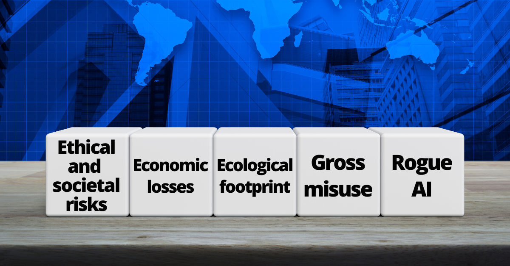

# Framework of major AI harms
Published on 22 April 2023, last updated on 11 November 2023 by [Nik Samoylov](https://www.campaignforaisafety.org/author/nik/)

The Campaign for AI Safety is emphasises the existential risk from machine intelligence. But it is useful to delineate the many different way AI companies are already hurting the public or expect to inflict harm on people soon. If companies are allowed to scale AI (in model sizes, capabilities, hardware proliferation of use throughout the economy, etc.) without strong regulation, public control, and upper limits on what AI is allowed to be able to do, we can expect these harms to scale as well. Below is a framework for categorising major perils from AI into five groups:

1.  [Ethical and societal risks](#ethical-and-societal-risks)
2.  [Economic losses](#economic-losses)
3.  [Ecological footprint](#ecological-footprint)
4.  [Gross misuse](#gross-misuse)
5.  [Rogue AI](#rogue-ai)

The last three categories of major risk can lead to end of human civilisation (x-risk). The first two categories of major risk are slightly less severe.

Ethical and societal risks
--------------------------

Artificial intelligence (AI) has the potential to bring about significant benefits, but it also comes with various ethical risks. Some of the main ethical concerns associated with AI include:

*   **Bias and discrimination**: AI systems can perpetuate and amplify existing biases present in the data they are trained on, leading to unfair treatment and discrimination against certain groups or individuals.
*   **Disinformation and Propaganda**: AI-generated content, such as deepfakes, can be used to spread disinformation, manipulate public opinion, and undermine the credibility of news sources and political figures.
*   **Privacy and surveillance**: AI-powered surveillance technologies may invade people's privacy, potentially enabling widespread monitoring and control by governments or corporations. One clear example of current (not hypothetical) privacy invasion is that developers have a hard time removing personally identifiable information from large language models, which is a [violation of the right to be forgotten](https://dhillemann.medium.com/does-chatgpt-comply-with-eu-gdpr-regulations-investigating-the-right-to-be-forgotten-fc97bb321d3a?ref=campaignforaisafety.org).
*   **Power concentration**: As AI technology advances, there is a risk that the power and control over AI systems may become concentrated in the hands of a few corporations or governments, leading to monopolistic or dictatorial behavior.
*   **Artificial moral agents**: As AI systems become more sophisticated, they may develop the capacity for moral reasoning. This raises questions about the legal and ethical frameworks that should guide AI behavior. Of particular concern is application of such reasoning in legal and law enforcement contexts, where AI may be used to prioritise and drive prosecution of certain crimes.

See also [Ethics of artificial intelligence - Wikipedia](https://en.wikipedia.org/wiki/Ethics_of_artificial_intelligence?ref=campaignforaisafety.org)

Economic losses
---------------

AI has the potential to bring about significant economic benefits to some people, but it also comes with various economic risks:

*   **Job displacement**: AI systems may replace human workers in many industries, leading to widespread unemployment and economic disruption.
*   **Copyright infringement:** AI models are trained on vast amount of data. Often that includes copyrighted data, such as works of art and technical documentation, that are taken from creators in violation of their copyright without permission or compensation.
*   **Economic inequality**: AI may exacerbate existing economic inequality, as the benefits of AI are captured by a small number of people and corporations.
*   **Bankruptcy**: AI may lead to widespread bankruptcy of companies, as they are unable to compete with AI labs and big tech.
*   **Diminished tax base**: AI may lead to a lack of sources for government revenue, as AI labs are located only in a few countries (such as the US, UK, Canada, and China).

🛤️ It's worth noting that AI may have positive impacts on the economy too, by growing the total pie (total economic output) in the short term, the promise of which is luring the current wave of interest and investment in AI technologies.

Ecological footprint
---------------

Scaling data centers and artificial intelligence (AI) systems can have several ecological impacts. Here are the main ones:

*   **Energy Consumption**: Data centers and AI systems require a significant amount of energy to operate. This leads to increased greenhouse gas emissions, especially if the energy is sourced from non-renewable sources.
*   **E-Waste**: Data centers and AI systems rely on hardware that eventually becomes obsolete and needs to be replaced. This generates electronic waste (e-waste), which can be harmful to the environment if not properly disposed of or recycled.
*   **Resource Depletion**: The manufacturing of hardware for data centers and AI systems requires a significant amount of resources, including rare earth metals. The extraction and processing of these materials can lead to environmental degradation and resource depletion.
*   **Heat Generation**: Data centers generate a lot of heat, which needs to be managed to prevent equipment from overheating. This often requires energy-intensive cooling systems (e.g. water).
*   **Land Use**: Large-scale data centers require significant amounts of land, which can lead to habitat destruction and loss of biodiversity.

Gross misuse
------------

*   **Cyberattacks**: AI-enhanced cyberattacks could lead to more sophisticated hacking techniques, targeting critical infrastructure (such as nuclear power plants and the elecrticity grid), financial systems, and logistics.
*   **Autonomous weapons**: AI-powered weapons, such as lethal autonomous drones or robots, could be used to conduct warfare with little or no human intervention, increasing the risk of unintended escalation and collateral damage.
*   **Surveillance and privacy violations**: AI-driven surveillance systems can be misused for industrialised blackmail, to suppress dissent, and to manipulate social behavior.
*   **Digital and physical security**: AI-driven security systems could be misused to create more invasive monitoring and control mechanisms, eroding individual freedoms and human rights.

Rogue AI
--------

There are many examples of various AI systems achieving the exact goals they were designed to achieve, but in surprising ways that violate a commonsense understanding. Some of them already cause incidents:

See also [the Artificial Intelligence Incident Database](https://incidentdatabase.ai/?ref=campaignforaisafety.org)

As AI labs continue to scale existing models, more advanced AI systems may similarly technically satisfy specifications in ways that violate what we actually want. This is known as "misalignment" (as in lack of alignment of AI's goals with humans' goals).

Unlike past technological advancements, poorly-directed advanced AI could be catastrophic for humanity. Our typical playbook regarding new technologies is to deploy them before tackling all potential major issues, then adjust them over time. With advanced AI, on the other hand, early failure at appropriately directing these systems may preclude later course correction, possibly yielding a catastrophe.

The current paradigm of advanced artificial intelligence called "deep learning" produces AI models that are trained very much unlike biological brains, do not share or support human values, and are basically alien to biological life on this planet.

What's more concerning is that:

*   in over two decades of research, **there have been no major breakthroughs** in alignment of advanced AI systems.
*   there is a lot of research pointing to **impossibility of alignment** of overly advanced AI systems.

See also [Top 10 AI Safety Papers](https://romanyam.medium.com/top-10-ai-safety-papers-7a9d280a260e?ref=campaignforaisafety.org)

